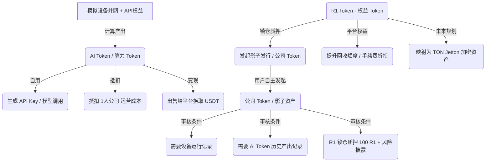

# R1 增长终端 V1 资产模型

本文件详细阐述了 R1 增长终端生态内的核心资产体系，明确区分了算力额度与加密代币的边界。

---

## 1. AI Token / 算力 Token (算力额度)

*   **本质定位**：AI Token（又称算力 Token/算力碎片）是平台内部的**大模型可使用额度 / API 调用额度**。它**不是加密货币**，不具有任何区块链链上代币属性。
*   **产出途径**：由用户购买并部署的“模拟设备 + API 权益”通过日常并网运算和任务代工产生。
*   **核心用途**：
    1.  **生成 API Key**：将 AI Token 转化为平台 API 接口调用密钥，供开发者或自用模型调用。
    2.  **模型调用折抵**：直接在平台内置的对话界面或大模型推理面板消耗以换取生成服务。
    3.  **回收变现**：在平台回收额度内，可以将 AI Token 出售给平台以换取模拟金 USDT。
    4.  **抵扣公司费用**：作为“1人算力公司”运营时的日常冷却液、电费和服务器租用费的抵扣券。

---

## 2. R1 Token (平台权益 Token)

*   **本质定位**：R1 是整个算力调度平台的**核心权益 Token**。
*   **账本状态**：当前为**内部中心化账本资产**（演示环境中为本地存储数据），未来将规划映射到区块链网络上作为 **TON Jetton 代币**。
*   **非设备直接产出**：R1 **不会**由用户的算力设备直接运算产出。用户需要通过平台任务、团队节点加权结算或在交易市场中使用 USDT 购买获得。
*   **核心用途**：
    1.  **锁仓质押**：发行用户自定义“公司 Token”时，必须锁仓至少 100 R1 作为风险押金。
    2.  **公司挂牌**：公司影子 Token 申请挂牌支持池需要消耗或锁定 R1。
    3.  **权益折扣**：持有或锁仓 R1 可享受交易手续费折扣、优先回收通道等。

---

## 3. 公司 Token (企业影子代币)

*   **本质定位**：这是由用户发行的、代表其专属“1人算力公司”的项目支持池模拟代币。
*   **防泛滥审核机制**：用户不能随意凭空创造和挂牌公司 Token。任何公司 Token 的发行均需要经过平台严格的机制审核，其条件包括：
    1.  **真实的设备并网记录**：发行人必须有至少一台正常运行的模拟算力设备。
    2.  **AI Token 历史产出记录**：需要证明其在平台中产出并调度过一定额度的 API 算力碎片（累计 AI Token 产出 >= 500 AI Token，或达到平台规定的 AI Token 贡献等级。这只是平台贡献门槛折算，不代表设备直接产出 R1）。
    3.  **R1 锁仓押金**：发行时必须锁定 100 R1 作为履约担保押金。
    4.  **详细的风险披露书**：必须披露公司影子代币的模拟性质以及算力规划说明。
