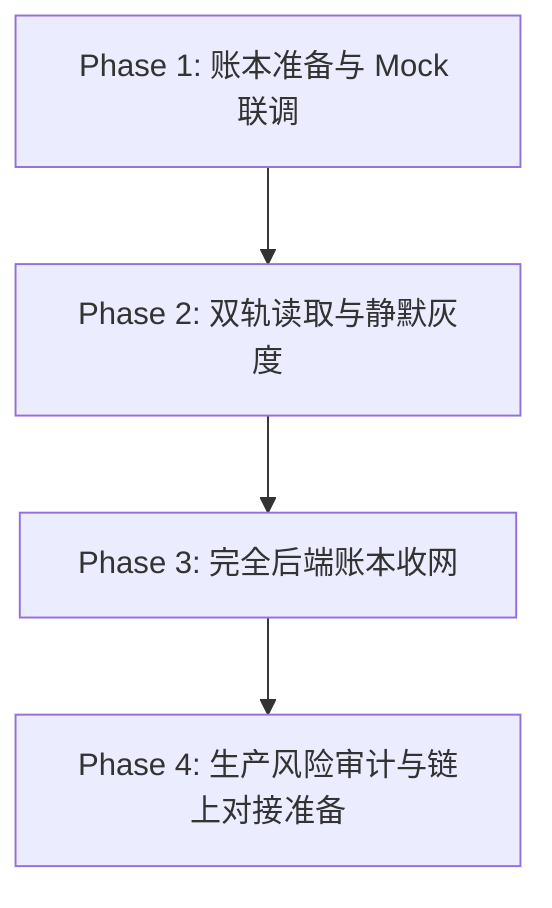

# 前后端过渡与数据迁移方案 (Frontend-Backend Migration Plan)

本方案定义了 1人算力公司 (1ren) 在接下来的系统升级中，如何逐步且安全地将资产状态从完全依赖前端本地存储 (`localStorage`) 平滑过渡到以受控后端账本 (`Backend Ledger`) 为准的演进路径。

---

## 整体迁移演进路线图 (Roadmap)

---

## 1. Phase 1：后端 Mock 联调与 LocalStorage Fallback

### 1.1 核心策略
- 后端服务接口基本框架搭建完毕，各核心接口目前返回 Mock 的账本状态与动账明细。
- 前端代码保持现有的 `localStorage` 读写逻辑为主，作为核心的状态源。
- 前端新增一键“同步后端测试数据”的开关，允许在本地开发及调试环境下与后端 Mock API 进行协议连调。

### 1.2 技术实施
- 前端实现 `src/services/api.ts` 基础 Axios/Fetch 封装层。
- 封装 `loadStats`、`loadMiners`、`loadRecords` 的底层适配器（Adapter）。若 API 连接失败，自动无缝回滚降级读取 `localStorage`。

---

## 2. Phase 2：双轨并行读取与静默灰度验证

### 1.1 核心策略
- 后端服务正式上线结构化数据库（如 PostgreSQL），并实现完整的动账流水与鉴权逻辑。
- 系统进入“双轨并行”阶段：根据用户的登录/会话状态进行动态路由切换。
  - **已登录用户**：前端优先通过 Bearer Token 调用后端接口拉取设备、资产余额和记录，完全废弃该用户本地的 `localStorage`（静默置空）。
  - **未登录/游客用户**：继续使用 `localStorage` 读写本地的 Demo 影子数据，确保零门槛的演示体验依然可用。

### 1.2 容错与平滑同步
- 用户初次从“游客”转化为“登录用户”时，前端在调用登录接口时，可选择性将本地 `localStorage` 的暂存数据作为 Payload 上传给后端合并。
- 后端在校验上传的 Demo 矿机、余额没有明显的作弊特征后，一次性写入初始化用户数据库，实现体验进度的无缝继承。

---

## 3. Phase 3：完全后端账本收网与资产唯一可信源

### 3.1 核心策略
- 资产状态、设备运行时间、收益结算和代币市场流通的判定权完全收回后端服务，前端失去状态修改权限，沦为纯净的 **“哑终端 (Dumb Client)”**。
- `localStorage` 在该阶段只允许存储：
  - 用户鉴权令牌 `session_token`。
  - 用户的本地 UI 偏好设置（如暗黑模式切换、语言选择、新手引导是否已读等）。
- 任何试图通过前端伪造动账的行为，都将在后端接口拦截并抛出鉴权或校验错误。

### 3.2 技术实施
- 彻底移除前端定时 ticking 自动给 activeMiners 增加收益的逻辑，改为向后端轮询 `GET /api/devices`，由后端计算收益差额并返回。
- 前端设备状态、USDT 余额完全由接口实时驱动，若接口操作失败，前端立即重置 UI 为上一次的合法后端状态，彻底解决刷钱挂机外挂。

---

## 4. Phase 4：接入真实资产与链上映射的生产级风险审计

### 4.1 核心策略
- 在为系统正式接入真实的 TON 钱包、真实 USDT 充值和链上代币（Jetton）映射发行前，必须进行最严苛的安全与合规审计。

### 4.2 审计与合规检查项
- **智能合约审计**：所有即将部署至 TON 主网的代币及质押划转合约，必须通过业内顶尖的安全审计公司的审计并出具报告。
- **防止双花与并发防刷**：后端动账账本 (`ledger_entries`) 必须开启数据库行级排他锁 (`SELECT FOR UPDATE`)，在高并发下进行扣减校验，并在提现、划转处加入基于 Redis 的幂等性防双花锁。
- **法律与合规隔离**：
  - 增加极其详尽的用户使用服务条款（ToS）及免责协议。
  - 对影子公司代币与真实链上代币的转换增设审查流，确保不触碰任何国家和地区关于非法证券代币发行 (ICO) 与虚拟资产洗钱 (AML) 的合规底线。
